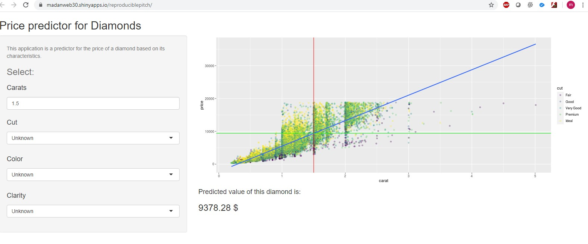

ReproduciblePitch
========================================================
author: "Madan Mohan Kumar"
date: "11/06/2020"
autosize: true


Application Overview
========================================================
- Diamonds Properties can be analysed using several Parameters.
- Carat,Price,sample size,color Depth are some of the common parameters.
- This Report enables to pick the right parameters for the best Diamond selection.

Table used for Data
========================================================

```
# A tibble: 53,940 x 5
   carat cut       color clarity price
   <dbl> <ord>     <ord> <ord>   <int>
 1 0.23  Ideal     E     SI2       326
 2 0.21  Premium   E     SI1       326
 3 0.23  Good      E     VS1       327
 4 0.290 Premium   I     VS2       334
 5 0.31  Good      J     SI2       335
 6 0.24  Very Good J     VVS2      336
 7 0.24  Very Good I     VVS1      336
 8 0.26  Very Good H     SI1       337
 9 0.22  Fair      E     VS2       337
10 0.23  Very Good H     VS1       338
# ... with 53,930 more rows
```
Shiny Application
========================================================



Links
========================================================
Click the Below Link for the Application.

<https://madanweb30.shinyapps.io/reproduciblepitch/>

Click the Below Link for the github presentation.

<https://github.com/madanweb30/hiny-Application-and-Reproducible-Pitch>
